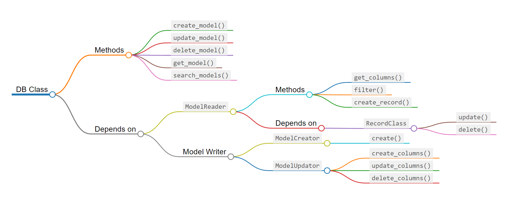

*This is still underconstruction, so many of what's writting here is still not developed*

# Kash ORM

Build, edit and delete SQL tabels, And record on the run.
KashORM allows to intreact with a datbase without need to definning static models for it.
Used for systems that require editing databased on the run

## DB Library

- The DB library is built with SQLAlchemy and it meant to work with PostgreSQL
- As shown in the graph, there is no specific model defined. Instead, the library is built to create model from the SQL tables on the connected database

## Tests
- Using [PyTest](https://docs.pytest.org/en/7.1.x/) as the testing framwork for this project 

## Usefull Links
some usefull docs pages that I'm using for the project:
- SQL Alchemy with autoload [link](https://www.blog.pythonlibrary.org/2010/09/10/sqlalchemy-connecting-to-pre-existing-databases/) and [link2](https://gtpedrosa.github.io/blog/using-sqlalchemy-to-navigate-an-existing-database/)
- SQL Alchemy with automp [link](https://docs.sqlalchemy.org/en/14/orm/extensions/automap.html)
- SQLAlchemy AuthMap [link](https://docs.sqlalchemy.org/en/14/orm/extensions/automap.html)
- SQLAlchemy Class mapping API [link](https://docs.sqlalchemy.org/en/14/orm/mapping_api.html#sqlalchemy.orm.registry.map_imperatively)

